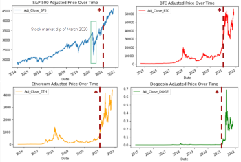
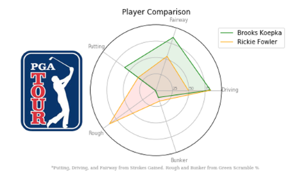

  

      <ul class="nav">
          <li><a href="/assets/RESUME_Arbide_Kyle.pdf">Resume</a></li>
          <li><a href="https://github.com/kylearbide">github</a></li>
          <li><a href="https://www.linkedin.com/in/kyle-arbide/">LinkedIn</a></li>
      </ul>
  

### Check Out My Course Work And Projects

<table class="wide">
<tr>
  <td class="left">
    
  </td>
</tr>
<tr>  
  <td class="left">
    
    <h4 id="course_work_front_page">"MS in Data Analytics at George Washington Univeristy, Course Work"</h4>
  </td>
</tr>
<tr>
  <td class="left">
    
  </td>
</tr>
<tr>
  <td class="left">
    
  </td>
</tr>
</table>
<!--

  

      <ul class="nav">
          <li><a href="morefigs.html">see more figures</a></li>
      </ul>
  

 -->
