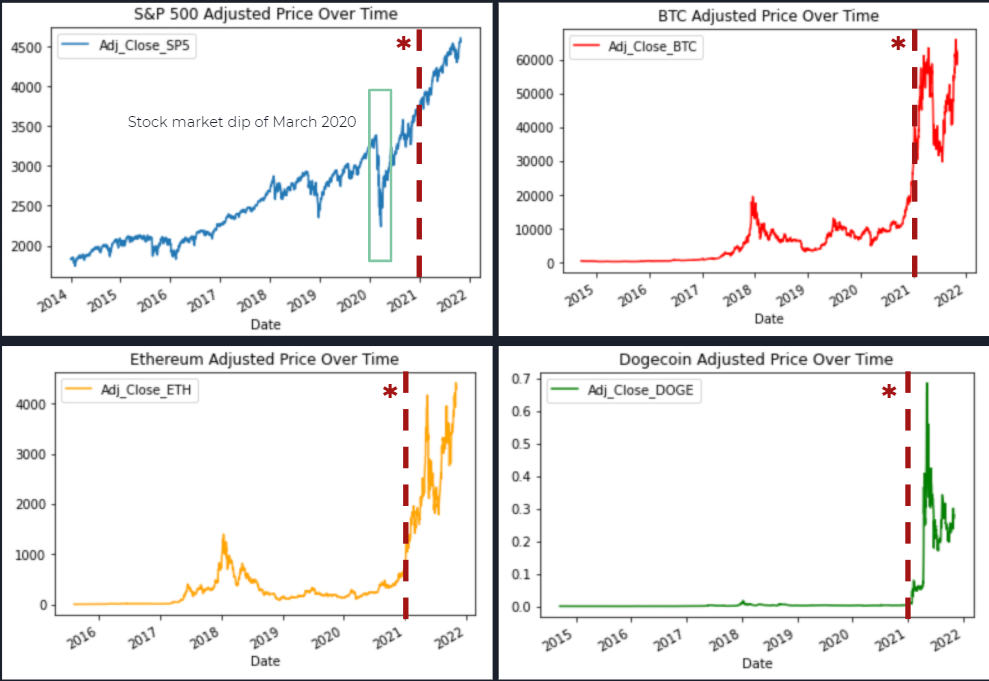

  

      <ul class="nav">
          <li><a href="geneticmaps_fig3.html">prev</a></li>
          <li><a href="tian2016_fig4.html">next</a></li>
      </ul>
  

**A Comparitave Analysis on Cryptocurrencies and Their Market Coorelation.

This analysis dives in depth on the market trends of cryptocurrencies, specifically Bitcoin Ethereum, and Dogecoin. We also look into the S&P500, with the goal of determining if cryptocurries can act as a safehaven from big market downturns. Our presentation and report go in depth on this topic, but below you will find a short summary of our analyses and results.

[Report ](/assets/CryptoFiles/Crypto_Report.pdf)

[Presentation ](/assets/CryptoFiles/Crypto_Rres.pdf)

<!-- --->
<!-- --->

<!--

Static view of an [interactive graph](http://kbroman.org/qtlcharts/example/iplotCorr.html)
from [R/qtlcharts](http://kbroman.org/qtlcharts). The left panel is a heatmap of a correlation
matrix; click a pixel and the corresponding scatterplot is shown on
the right. -->
