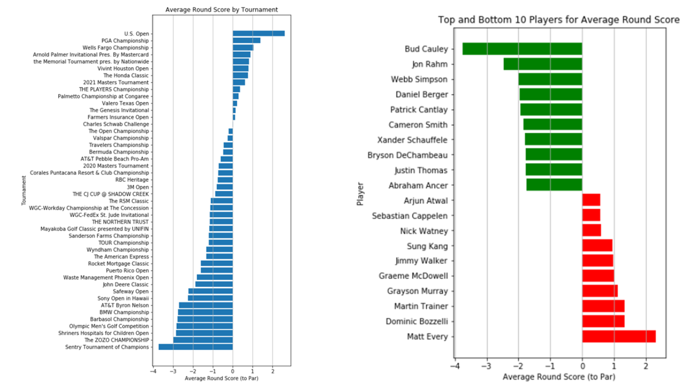
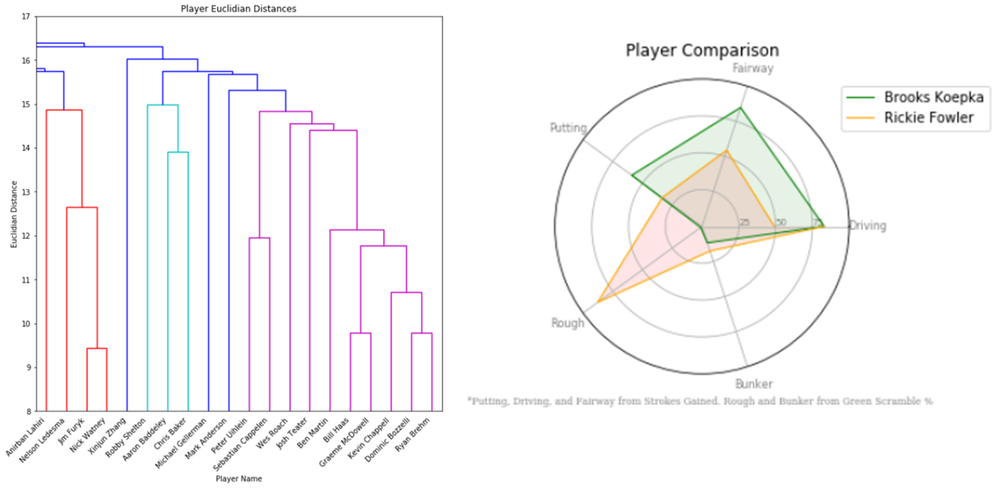

  

      <ul class="nav">
          <li><a href="CryptoTimeSeries.html">prev</a></li>
          <li><a href="samplemixups_fig7.html">next</a></li>
      </ul>
  

#### PGA Analysis Abstract
As sports data becomes widely available online, the popularity of sports analysis also grows. Sports statisticians are constantly trying to improve their prediction models in an attempt to "beat the odds". This report is an attempt to become familiar with sports data and analysis and its application using PGA tour data and player statistics. It also uses these statistics to create a linear regression model that will predict tournament results. There were many steps in attempting to increase the validity of this model, resulting in a not so accurate regression model with an R-squared score of ~0.45. Finally, the result of this regression will be compared to other researched models and conclusions will be drawn on where to improve moving forward. 

[Full Report ](/assets/PGAFiles/PGA_Analysis_Report.pdf)
[Presentation ](/assets/PGAFiles/PGA_TOUR_Pres.pdf)

These two figures provide player and tournament rankings using average round scores. We notice the field generally scores high in the US Open and PGA Championship, so perhaps these are the more difficult courses. The same observation can be made looking at the player round scores, the players in green could be considered some of the best, while those in red may be some of the worst in this dataset.

Above, the dendrogram and spider plot are used as advanced visuals for player comparison. The dendrogram uses tournament results to compare players based on their 2020 season performances. The full report contains this visuals using both Euclidean and cosine distances, and also compares tournaments based on the player performance. The spider plot uses player statistics, mostly measured by strokes gained and greens in regulation, to compare players based on their skills. The visual above sugguests Koepka outperforms Fowler in the fairway and on the green. 

To see more visuals like those above, or to see the regression model building and results, see the full report and codesheets linked above.
