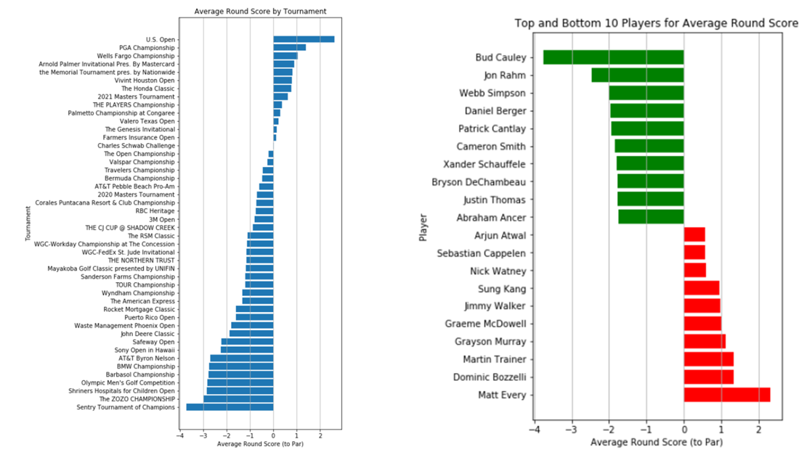

  

      <ul class="nav">
          <li><a href="CryptoTimeSeries.html">prev</a></li>
          <li><a href="samplemixups_fig7.html">next</a></li>
      </ul>
  

#### PGA Analysis Abstract
As sports data becomes widely available online, the popularity of sports analysis also grows. Sports statisticians are constantly trying to improve their prediction models in an attempt to "beat the odds". This report is an attempt to become familiar with sports data and analysis and its application using PGA tour data and player statistics. It also uses these statistics to create a linear regression model that will predict tournament results. There were many steps in attempting to increase the validity of this model, resulting in a not so accurate regression model with an R-squared score of ~0.45. Finally, the result of this regression will be compared to other researched models and conclusions will be drawn on where to improve moving forward. 

[Full Report ](/assets/PGA_Analysis_Report.pdf)

<!--

-->

**Figures**. These two figures provide player and tournament rankings using average round scores. We notice the field generally scores high in the US Open and PGA Championship.
